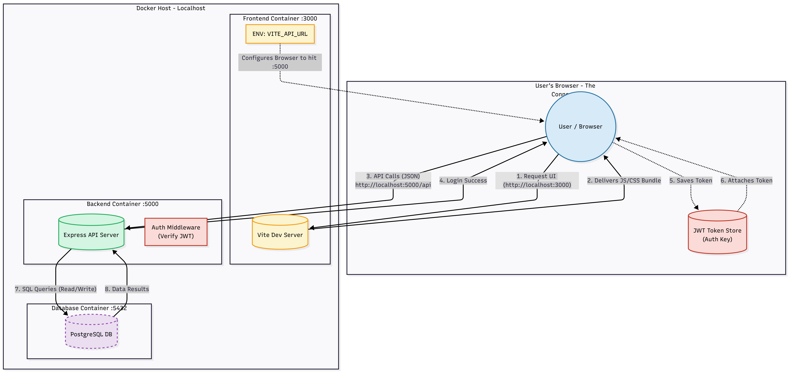

# SAAS-Project-Task-Application - Multi-Tenant Project Management Platform

**SAAS-Project-Task-Application** is a modern, production-ready SaaS boilerplate designed for project and task management. It features a scalable multi-tenant architecture where organizations (tenants) share a single database while maintaining strict data isolation. Built with performance and security in mind, it provides a seamless experience for admins and team members alike.

## 🚀 Key Features

* **Multi-Tenancy Support**: Robust "Shared Database, Shared Schema" architecture with tenant isolation using Discriminator Columns.
* **Tenant Registration**: Automated onboarding workflow allowing organizations to register with unique subdomains.
* **Secure Authentication**: Stateless JWT authentication with secure cookie/header handling and `bcrypt` password hashing.
* **Role-Based Access Control (RBAC)**: Distinct permissions for Super Admins, Tenant Admins, and Regular Users.
* **Project & Task Management**: Full CRUD capabilities for projects and tasks with status tracking and priority assignment.
* **User Management**: Tenant Admins can invite, manage, and remove users within their organization.
* **Responsive Dashboard**: A modern, mobile-friendly UI built with React and Tailwind CSS.
* **Automated DevOps**: Fully containerized with Docker, featuring automatic database migrations and seeding on startup.
* **System Health Checks**: Built-in API endpoints for monitoring system and database connectivity.

---

## 🛠️ Technology Stack

### **Frontend**
* **Framework**: React 18
* **Build Tool**: Vite 5.x
* **Styling**: Tailwind CSS 3.x
* **State Management**: React Context API
* **HTTP Client**: Axios

### **Backend**
* **Runtime**: Node.js v18 (Alpine Linux)
* **Framework**: Express.js
* **Database Interface**: `pg` (node-postgres)
* **Security**: `jsonwebtoken`, `bcryptjs`, `cors`

### **Infrastructure & Database**
* **Database**: PostgreSQL 15
* **Containerization**: Docker & Docker Compose
* **Orchestration**: Docker Compose (v3.8+)

---

## 🏗️ Architecture Overview

The system follows a **Monolithic Service Architecture** separated into frontend and backend containers, communicating via REST APIs.

[](docs/images/system-architecture.png)

1. **Client**: The user's browser loads the React SPA.
2. **Frontend**: Served via Vite (in dev) or Nginx (in prod), interacting with the backend API.
3. **Backend**: Express.js server handles business logic, auth verification, and tenant scoping.
4. **Database**: PostgreSQL stores all data, isolated logically by `tenant_id`.

---

## ⚙️ Installation & Setup

### **Prerequisites**
* [Docker Desktop](https://www.docker.com/products/docker-desktop/) (Latest Version)
* Git

### **Step 1: Clone the Repository**
```bash
git clone https://github.com/Ravindra-Reddy27/SAAS-Project-Task-Application.git
cd SAAS-Project-Task-Application
```

### **Step 2: Environment Configuration**

The project comes with default development settings. Ensure you have the following .env file in your backend directory (or rely on docker-compose.yml defaults):

**Backend (backend/.env):**
```ini
PORT=5000
NODE_ENV=development
DB_HOST=database
DB_PORT=5432
DB_NAME=saas_db
DB_USER=postgres
DB_PASSWORD=postgres
JWT_SECRET=super_secret_key_for_testing_only_12345
JWT_EXPIRES_IN=24h
FRONTEND_URL=http://frontend:3000
```

### **Step 3: Start the Application**

Run the entire stack with a single command. This handles building images, creating networks, and starting services.
```bash
docker-compose up -d --build
```

### **Step 4: Database Initialization (Migrations & Seeds)**

**Automated Process:**

The Docker setup is configured to automatically run migrations and seed data when the database container starts for the first time.

* **Migrations**: Creates tables (tenants, users, projects, tasks).
* **Seeds**: Populates the DB with a demo tenant, admin user, and sample tasks.

No manual command is required. You can verify this by checking the logs:
```bash
docker-compose logs database
```

---

## 🧪 Testing the Application

Once the containers are up, access the services:

* **Frontend UI**: http://localhost:3000
* **Backend API**: http://localhost:5000
* **Health Check**: http://localhost:5000/api/health

### **Default Login Credentials**

Use these credentials (from seed data) to log in:

| Role | Email | Password | Subdomain |
|------|-------|----------|-----------|
| Tenant Admin | admin@demo.com | Demo@123 | demo |
| Regular User | user1@demo.com | User@123 | demo |
| Super Admin | superadmin@system.com | Admin@123 | system |

---

## 🔑 Environment Variables Reference

| Variable | Description | Default Value |
|----------|-------------|---------------|
| PORT | Backend server port | 5000 |
| DB_HOST | Database hostname (Docker service name) | database |
| DB_PORT | Database port | 5432 |
| DB_NAME | PostgreSQL database name | saas_db |
| JWT_SECRET | Secret key for signing tokens | (Must be secure) |
| FRONTEND_URL | Allowed Origin for CORS | http://frontend:3000 |
| VITE_API_URL | API Base URL for Frontend | http://localhost:5000/api |

---

## 📚 API Documentation

The backend exposes the following main RESTful endpoints:

### **Authentication**
* `POST /api/auth/register-tenant` - Register a new organization.
* `POST /api/auth/login` - Authenticate user and receive JWT.
* `GET /api/auth/me` - Get current user profile.

### **Tenants & Users**
* `GET /api/tenants/:id` - Get tenant details.
* `GET /api/tenants/:id/users` - List all users in a tenant.
* `POST /api/tenants/:id/users` - Add a new user to a tenant.

### **Projects & Tasks**
* `GET /api/projects` - List all projects.
* `POST /api/projects` - Create a new project.
* `GET /api/projects/:id/tasks` - List tasks for a specific project.
* `POST /api/projects/:id/tasks` - Create a task.
* `PATCH /api/tasks/:id/status` - Update task status.