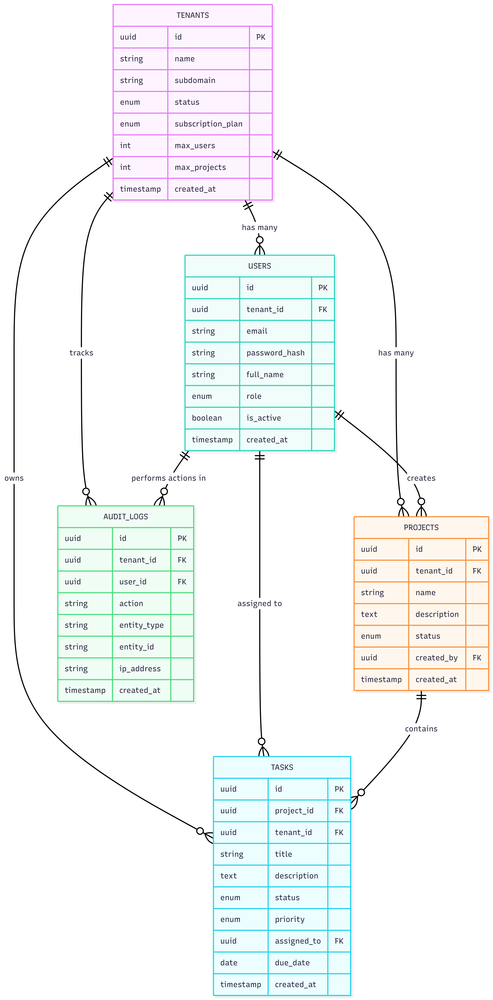

# System Architecture Document

## Multi-Tenant SaaS Platform – Project & Task Management System

---

## 1. Overview

This document describes the system architecture, database design, and API architecture for the Multi-Tenant SaaS Platform. The system is designed to support multiple organizations (tenants) using a single application instance while ensuring strict data isolation, role-based access control, and subscription enforcement.

The architecture follows a three-tier design:

1. **Frontend (Client Layer)**
2. **Backend API (Application Layer)**
3. **Database (Data Layer)**

All components are containerized using Docker and orchestrated with Docker Compose.

---

## 2. System Architecture

### 2.1 High-Level Architecture Description

The system consists of the following components:

**Client (Web Browser)**

- Users access the application through a web browser.
- Communicates only with the frontend application.

**Frontend Application (React)**

- Provides UI for registration, login, dashboard, projects, tasks, and users.
- Handles role-based UI rendering.
- Communicates with backend APIs via HTTP.
- Does not directly access the database.

**Backend API Server (Node.js + Express)**

- Exposes RESTful APIs.
- Handles authentication, authorization, and business logic.
- Enforces tenant isolation and subscription limits.
- Communicates with the database.

**Database (PostgreSQL)**

- Stores all application data.
- Contains tenant-isolated records using `tenant_id`.
- Enforces relational integrity via foreign keys.

### 2.2 Authentication Flow

1. User logs in via frontend.
2. Frontend sends credentials to backend.
3. Backend validates credentials.
4. Backend issues a JWT token containing:
   - `userId`
   - `tenantId`
   - `role`
5. Frontend stores JWT token.
6. All protected requests include the token in the Authorization header.

### 2.3 System Architecture Diagram

The high-level architecture diagram illustrates:

- Browser → Frontend → Backend → Database
- JWT-based authentication flow
- Role-based access control
- Tenant isolation logic

📌 **Diagram file location:** `docs/images/system-architecture.png`

[](images/system-architecture.png)
*(Click image to enlarge)*

---

## 3. Database Schema Design

### 3.1 Database Overview

The application uses a single PostgreSQL database with a shared schema. Tenant isolation is enforced using a `tenant_id` column in all tenant-specific tables.

Super admin users are not associated with any tenant and therefore have `tenant_id = NULL`.

### 3.2 Core Tables and Relationships

#### 1. tenants

Stores organization details and controls subscription plans and limits.

**Key Fields**

- `id` (PK)
- `name`
- `subdomain` (unique)
- `subscription_plan`
- `max_users`
- `max_projects`

#### 2. users

Stores all user accounts and is linked to tenants.

**Key Fields**

- `id` (PK)
- `tenant_id` (FK → `tenants.id`, nullable for `super_admin`)
- `email`
- `password_hash`
- `role`

**Rules**

- Email unique per tenant
- CASCADE delete with tenant

#### 3. projects

Stores projects belonging to tenants.

**Key Fields**

- `id` (PK)
- `tenant_id` (FK → `tenants.id`)
- `created_by` (FK → `users.id`)

#### 4. tasks

Stores tasks under projects.

**Key Fields**

- `id` (PK)
- `project_id` (FK → `projects.id`)
- `tenant_id` (FK → `tenants.id`)
- `assigned_to` (FK → `users.id`, nullable)

**Important Rule**

`tenant_id` for tasks is derived from the project, not from client input.

#### 5. audit_logs

Tracks all critical system actions.

**Key Fields**

- `tenant_id`
- `user_id`
- `action`
- `entity_type`
- `entity_id`
- `created_at`

### 3.3 Entity Relationship Diagram (ERD)

The ERD shows:

- Table relationships
- Foreign keys
- Tenant isolation via `tenant_id`
- Cascade delete rules

📌 **ERD file location:** `docs/images/database-erd.png`

[](images/database-erd.png)
*(Click image to enlarge)*


---

## 4. API Architecture

### 4.1 API Design Principles

- RESTful API design
- JSON request and response format
- Consistent response structure:

```json
{
  "success": true,
  "message": "optional",
  "data": {}
}
```

- JWT-based authentication
- Role-based authorization
- Tenant isolation enforced at API level

### 4.2 API Modules & Endpoints

#### 🔐 Authentication Module

- `POST /api/auth/register-tenant`
- `POST /api/auth/login`
- `GET /api/auth/me`
- `POST /api/auth/logout`

#### 🏢 Tenant Management Module

- `GET /api/tenants/:tenantId`
- `PUT /api/tenants/:tenantId`
- `GET /api/tenants` (super_admin only)

#### 👤 User Management Module

- `POST /api/tenants/:tenantId/users`
- `GET /api/tenants/:tenantId/users`
- `PUT /api/users/:userId`
- `DELETE /api/users/:userId`

#### 📁 Project Management Module

- `POST /api/projects`
- `GET /api/projects`
- `PUT /api/projects/:projectId`
- `DELETE /api/projects/:projectId`

#### ✅ Task Management Module

- `POST /api/projects/:projectId/tasks`
- `GET /api/projects/:projectId/tasks`
- `PATCH /api/tasks/:taskId/status`
- `PUT /api/tasks/:taskId`

### 4.3 Authorization Rules Summary

| Role          | Access Scope                |
|---------------|----------------------------|
| super_admin   | All tenants                |
| tenant_admin  | Own tenant only            |
| user          | Assigned projects & tasks  |

---

## 5. Deployment Architecture (Docker)

All services run in Docker containers.

Docker Compose orchestrates:

- `database`
- `backend`
- `frontend`

Inter-service communication uses service names, not localhost.

---

## 6. Conclusion

This architecture ensures:

- Strong tenant isolation
- Secure authentication and authorization
- Scalability and maintainability
- Docker-based reproducible deployment

The system architecture aligns fully with the project requirements and evaluation criteria.